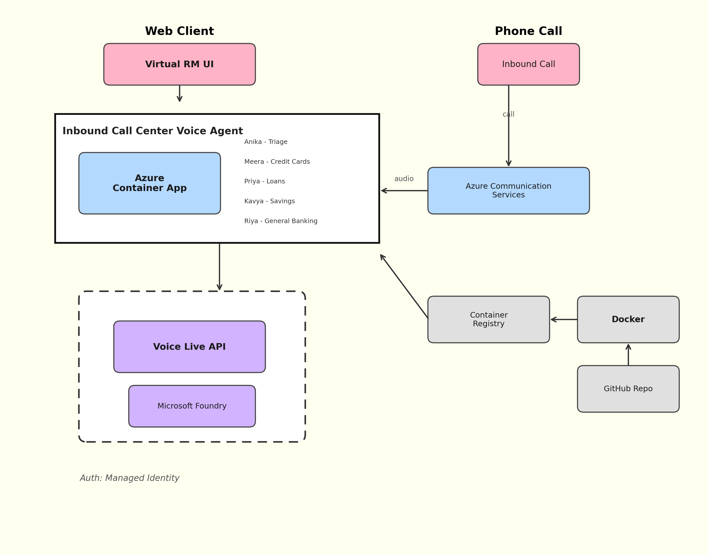

# 🏦 Virtual Relationship Manager — Contoso Bank

A real-time **voice AI agent** for banking customers, powered by **Azure Voice Live API**. Simulates a full inbound call center experience with intelligent triage, multi-agent handoffs, and human-like negotiation skills.

> **Demo credentials:** Any of `rajesh`, `priya`, `amit`, `sneha`, `vikram` with password `contoso123`

---

## What It Does

A customer calls Contoso Bank. **Anika** (Virtual RM) picks up, listens, and routes the call to the right specialist — just like a real call center. The specialist agent has full CRM access, follows bank SOPs, and can negotiate rates, handle complaints, process requests, and cross-sell products.

```
Customer speaks → Azure Voice Live (STT + LLM + TTS) → Agent responds in real-time
```

### Agent Pipeline

| Agent | Role | Specialization |
|---|---|---|
| **Anika** | Virtual RM (Triage) | Identifies intent, routes to specialist |
| **Meera** | Credit Card Specialist | Fee waivers, cancellations, upgrades, disputes, rewards |
| **Priya** | Loan Specialist | New loans, rate reduction, foreclosure, EMI restructure |
| **Kavya** | Savings Specialist | FDs, RDs, account closure, investments |
| **Riya** | General Banking | Complaints, fraud, debit cards, KYC |

---

## Functional Architecture



### Data Flow: Call Handling
|---|---|
| **Single WebSocket** | One Voice Live session per call — no reconnects, no latency gaps |
| **Prompt-based Handoff** | Agent switch via `session.update` (reconfigures instructions + tools mid-call) |
| **SOP Injection** | Each agent gets lean base prompt + dynamic SOP based on sub_intent |
| **No Model Swap** | gpt-4.1-mini handles all agents — cost-efficient, consistent reasoning |
| **Tool Filtering** | Each SOP specifies which tools are allowed → reduces hallucination risk |
| **Context Preservation** | Conversation history stays in Voice Live — triage context injected as preamble |

---

## Prerequisites

| Requirement | Details |
|---|---|
| **Azure subscription** | Active Azure subscription |
| **Azure Developer CLI** | [Install azd](https://learn.microsoft.com/azure/developer/azure-developer-cli/install-azd) |
| **Azure CLI** | Logged in (`az login`) |
| **Voice Live API access** | [Request access](https://aka.ms/voicelive) |
| **Browser** | Chrome/Edge (mic access required) |

---

## Deploy to Azure 

The fastest way to get running — provisions all infrastructure and deploys the app in one command.

```bash
# 1. Clone the repo
git clone <your-repo-url>
cd VirtualRM

# 2. Login to Azure
azd auth login

# 3. Deploy everything
azd up
```

`azd up` will prompt you for:
- **Environment name** — used as resource prefix (e.g., `virtualrm-dev`)
- **Azure region** — where to deploy (e.g., `eastus2`)

It then provisions: Resource Group → Managed Identity → Container Registry → Voice Live resource (Central India) → LLM resource (South India, with gpt-4.1-mini) → Container App, builds the image remotely in ACR, and deploys.

### Dual-Region Architecture

Voice Live and the LLM model are deployed to **separate regions** because of service availability:

| Resource | Region | Purpose |
|---|---|---|
| Voice Live (STT + TTS) | `centralindia` | Real-time speech processing |
| LLM (gpt-4.1-mini) | `southindia` | Model inference via BYOM |

Voice Live routes to the LLM via `BYOM_PROFILE=byom-azure-openai-chat-completion` — this is configured automatically by the Bicep template.

### Customize Resource Names

```bash
# Override defaults before running azd up
azd env set AZURE_RESOURCE_GROUP "my-custom-rg"
azd env set AZURE_CONTAINER_APP_NAME "my-virtualrm"
azd env set AZURE_AI_SERVICES_NAME "my-ai-service"
azd env set VOICE_LIVE_MODEL "gpt-4.1"

# Override regions if needed
azd env set VOICE_LIVE_LOCATION "centralindia"
azd env set LLM_LOCATION "southindia"
azd env set MODEL_SKU_NAME "GlobalStandard"
```

### Redeploy After Code Changes

```bash
azd deploy
```

### Tear Down

```bash
azd down
```

---

## Local Development

For running locally without Azure infrastructure:

### 1. Clone & Setup

```bash
git clone <your-repo-url>
cd VirtualRM
python -m venv server/.venv

# Windows
server\.venv\Scripts\activate

# macOS/Linux
source server/.venv/bin/activate

pip install -r requirements.txt
```

### 2. Configure Environment

```bash
cp .env.sample .env
```

Edit `.env` with your Azure details:

```env
# Required
AZURE_VOICE_LIVE_ENDPOINT=https://<your-resource>.services.ai.azure.com
AZURE_VOICE_LIVE_API_KEY=<your-api-key>        # OR leave blank to use Azure CLI auth
VOICE_LIVE_MODEL=gpt-4.1-mini

# Optional — BYO LLM (if model is on a different Foundry resource)
BYOM_PROFILE=
FOUNDRY_RESOURCE_OVERRIDE=

# Optional — Managed Identity (for Azure deployment)
AZURE_USER_ASSIGNED_IDENTITY_CLIENT_ID=
```

**Using Azure CLI auth instead of API key:**
```bash
az login
# Leave AZURE_VOICE_LIVE_API_KEY blank in .env
```

### 3. Seed & Run

```bash
cd server
python seed_db.py
python app.py
```

Server starts at **http://localhost:8000**.

### 4. Use the App

1. Open **http://localhost:8000** in Chrome/Edge
2. Login with any demo user (e.g., `rajesh` / `contoso123`)
3. Browse the banking dashboard, then click **"Talk to RM"** or the chat FAB
4. Click **"Start Conversation"** and allow microphone access
5. Speak naturally — Anika greets you and routes your query

---

## Demo Customers

| ID | Name | Segment | CIBIL | Monthly Income | Products |
|---|---|---|---|---|---|
| `rajesh` | Rajesh Kumar | Premium | 782 | ₹1.25L | Home Loan, Platinum Card, FD, MF |
| `priya` | Priya Sharma | Gold | 745 | ₹95K | Personal Loan, Gold Card, RD |
| `amit` | Amit Patel | Classic | 698 | ₹65K | Car Loan, Classic Card |
| `sneha` | Sneha Reddy | Platinum | 810 | ₹1.10L | Home Loan, Platinum Card, FD, PPF |
| `vikram` | Vikram Singh | Elite | 835 | ₹2.50L | Home + Car Loan, Elite Card, Investments |

---

## Try These Scenarios

| Scenario | What to Say | What Happens |
|---|---|---|
| **Loan rate negotiation** | "I want to reduce my home loan interest rate" | Multi-turn negotiation with 3 rounds of resistance, hold music, manager escalation |
| **Credit card cancellation** | "I want to cancel my credit card" | Retention flow: consequences → counter-offers → last resort bundle |
| **Fee waiver** | "Why am I paying annual fee?" | 3-tier concession: spend-based → 50% discount → full waiver |
| **New loan inquiry** | "I want a personal loan of 10 lakhs" | Eligibility check → product details → EMI illustration → rate negotiation |
| **FD booking** | "I want to open a fixed deposit" | Rate card → optimal tenure → tax-saver pitch → large amount strategy |
| **Complaint** | "I was charged wrongly" | Maximum empathy → transaction review → goodwill gesture |
| **Fraud** | "Someone used my card without my knowledge" | Immediate security → card block → dispute filing |

---

## Key Features

| Feature | Details |
|---|---|
| **Multi-agent orchestration** | Triage → specialist handoff via LLM function calling |
| **27 SOPs** | Detailed Standard Operating Procedures across 4 domains |
| **3-round negotiation** | Eligibility-gated, multi-turn rate negotiation with hold music |
| **22 CRM tools** | SQLite-backed tools for real-time data access |
| **Bilingual (EN/HI)** | Auto-detects Hindi/English; responds naturally |
| **Low latency** | Azure Semantic VAD + auto-truncate on interruption |
| **Barge-in** | Instant audio cancellation via AudioWorklet ring buffer |
| **Hold music** | Synthesized arpeggio melody, deferred until agent finishes speaking |
| **HD Voice** | Azure Dragon HD Neural voices |
| **Visual agent tracking** | Sidebar shows agent pipeline, handoff history, session info |
| **Response watchdog** | 5s safety net recovers dead sessions |
| **Connection heartbeat** | 30s dead connection detection with browser notification |

---

## Project Structure

```
VirtualRM/
├── azure.yaml                     # azd project definition
├── Dockerfile                     # Container build
├── requirements.txt               # Python dependencies
├── pyproject.toml                 # Project metadata
├── infra/                         # Azure infrastructure (Bicep)
│   ├── main.bicep                 # Orchestrator (subscription-scoped)
│   ├── main.parameters.json       # Parameterized config
│   ├── abbreviations.json         # Naming conventions
│   └── modules/
│       ├── managed-identity.bicep # User-assigned MI + RBAC
│       ├── container-registry.bicep # ACR + AcrPull role
│       ├── ai-services.bicep      # AI Services + model deployment
│       └── container-app.bicep    # Container App + env + scaling
├── hooks/                         # azd lifecycle hooks
│   └── postdeploy.sh             # Prints app URL after deploy
├── docs/                          # Documentation
│   ├── architecture.png           # Architecture diagram
│   ├── architecture.md            # System architecture & data flow
│   ├── agents.md                  # Agent personalities & configuration
│   ├── sops.md                    # Standard Operating Procedures
│   ├── crm-tools.md              # CRM database & tool functions
│   ├── voice-live-integration.md  # Azure Voice Live API integration
│   ├── frontend.md                # Browser UI & audio pipeline
│   └── deployment.md              # Deployment & configuration guide
└── server/
    ├── app.py                     # Main server (Quart + WebSocket relay)
    ├── crm_tools.py               # 22 CRM tool functions (SQLite)
    ├── seed_db.py                 # Database schema + seed data
    ├── agents/
    │   ├── __init__.py            # Agent registry (5 agents)
    │   ├── triage_agent.py        # Anika — intent detection & routing
    │   ├── credit_card_agent.py   # Meera — credit card specialist
    │   ├── loan_agent.py          # Priya — loan specialist + negotiation
    │   ├── savings_agent.py       # Kavya — savings & deposits specialist
    │   └── general_banking_agent.py # Riya — general banking
    ├── sops/
    │   ├── __init__.py            # SOP registry + tool filtering
    │   ├── credit_card_sops.py    # 6 credit card SOPs
    │   ├── loan_sops.py           # 8 loan SOPs (incl. rate negotiation)
    │   ├── savings_sops.py        # 6 savings SOPs
    │   └── general_sops.py        # 6 general banking SOPs
    └── static/
        ├── index.html             # Chat UI
        ├── home.html              # Banking dashboard
        ├── login.html             # Login page
        ├── app.js                 # WebSocket client + audio pipeline
        ├── audio-processor.js     # AudioWorklet ring buffer
        └── styles.css             # Glassmorphism UI theme
```

---

## How the Handoff Works

1. **Triage agent** (Anika) has a `route_to_agent(intent, sub_intent, summary)` function tool
2. LLM identifies the customer's intent and emits a function call
3. Server intercepts the function call, extracts routing info
4. Server sends `session.update` with the **specialist's prompt + SOP + filtered tools**
5. Server sends `response.create` to trigger the specialist's opening
6. Specialist agent takes over seamlessly — customer hears natural transition
7. Each SOP defines exactly which tools the agent needs, minimizing token usage

---

## Customization

### Adding a New Agent

1. Create `server/agents/new_agent.py` with prompt + tools
2. Register in `server/agents/__init__.py` (`AGENT_REGISTRY`)
3. Add sub-intent SOPs in `server/sops/`
4. Register SOPs in `server/sops/__init__.py`
5. Add intent to triage agent's routing table
6. Add agent card to `static/index.html`

### Changing Voice

Edit the `voice` field in `AGENT_REGISTRY` (`server/agents/__init__.py`).
See [Azure TTS voices](https://learn.microsoft.com/azure/ai-services/speech-service/language-support?tabs=tts).

### Changing Model

Set `VOICE_LIVE_MODEL` in `.env`. Supported: `gpt-4.1-mini`, `gpt-4.1`, `gpt-4o`, `gpt-5`.

### Adding CRM Data

1. Add tables/data in `server/seed_db.py`
2. Add tool functions in `server/crm_tools.py`
3. Register in `TOOL_FUNCTIONS` map
4. Add to agent's tool list and SOP's tool allowlist

---

## Detailed Documentation

See the [docs/](docs/) folder for in-depth documentation:

- **[Architecture](docs/architecture.md)** — System design, data flow, session lifecycle
- **[Agents](docs/agents.md)** — Agent personalities, tools, configuration
- **[SOPs](docs/sops.md)** — All 27 Standard Operating Procedures
- **[CRM & Tools](docs/crm-tools.md)** — Database schema, tool functions, negotiation engine
- **[Voice Live Integration](docs/voice-live-integration.md)** — WebSocket protocol, VAD, TTS, audio pipeline
- **[Frontend](docs/frontend.md)** — Browser UI, audio handling, WebSocket client
- **[Deployment](docs/deployment.md)** — Configuration, Azure deployment, troubleshooting

---

## Tech Stack

| Component | Technology |
|---|---|
| Server | Python 3.11+, Quart (async Flask), Hypercorn ASGI |
| Voice AI | Azure Voice Live API (preview) |
| LLM | GPT-4.1-mini via Microsoft Foundry |
| STT | Azure Speech (via Voice Live) |
| TTS | Azure Dragon HD Neural (via Voice Live) |
| Database | SQLite |
| Frontend | Vanilla HTML/JS, Web Audio API, AudioWorklet |
| Auth | Azure CLI credential / API key |

---

## References

- [Azure Voice Live API documentation](https://learn.microsoft.com/azure/ai-services/speech-service/voice-live-overview)
- [Microsoft Foundry](https://ai.azure.com)
- [Azure TTS voices](https://learn.microsoft.com/azure/ai-services/speech-service/language-support?tabs=tts)
- [Quart documentation](https://quart.palletsprojects.com)

---

## License

This is a demo/learning project. Not intended for production use without proper security hardening.
